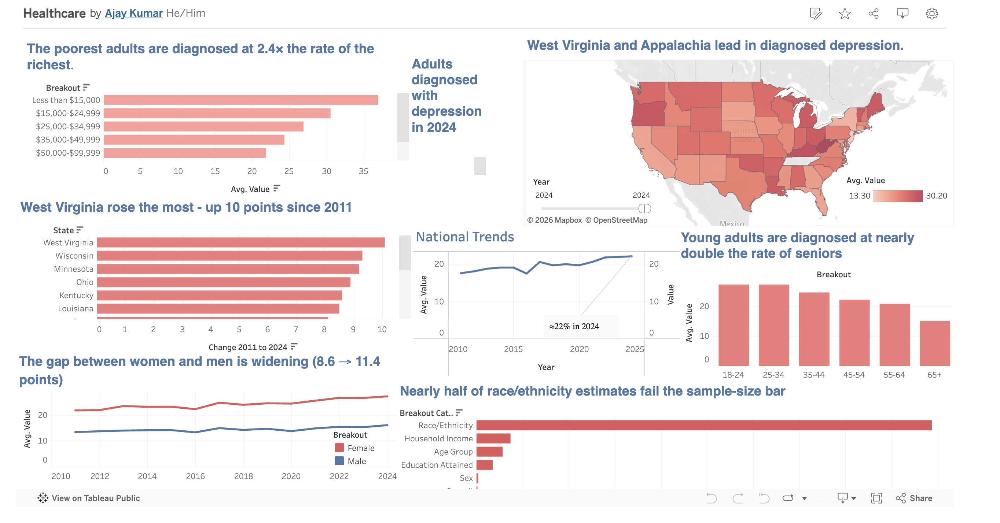

# Diagnosed Depression in America (2011–2024)

An interactive Tableau dashboard and analysis of self-reported depression diagnosis across the US, built on 14 years of CDC BRFSS survey data (3M+ rows).

**🔗 Live dashboard:** [View on Tableau Public](https://public.tableau.com/app/profile/ajaysingh0419/viz/Healthcare_17804417036170/Dashboard1?publish=yes)

---

## The question

Where, and among whom, is diagnosed depression concentrated in the US and what does survey data actually let us claim?

## Key findings

- **Rising:** national diagnosis rate climbed from ~17.5% (2011) to ~22% (2024), accelerating after 2019.
- **Income gradient (the clearest signal):** adults earning under $15k are diagnosed at **2.4× the rate** of those earning $200k+, a clean decline across every income band.
- **Widening sex gap:** women are diagnosed roughly twice as often as men, and the gap grew from 8.6 to 11.4 points since 2011.
- **Age:** young adults (18–24) are diagnosed at nearly double the rate of seniors (65+).

## Why this measures *diagnosis*, not depression

The survey asks whether a respondent was *ever told* they have depression. That reflects access to diagnosis as much as underlying prevalence, so geographic and demographic patterns are read with that in mind. The data is **crude (not age-adjusted)**, so cross-state differences are descriptive, not causal. Small-sample estimates (n < 50) were flagged and excluded — the dashboard includes a data-quality panel showing that ~46% of race/ethnicity estimates failed that bar, so race is intentionally not analyzed as a headline.

## Tech stack

- **Python + DuckDB** - queried and reduced a 1.1 GB raw CSV on disk (no full load into memory), applied SQL filtering, reliability flags, and confidence-interval fields.
- **Tableau Public** - KPI cards, choropleth map, trend lines with confidence intervals, disparity charts, data-quality panel.

## Repo contents

| File | What it is |
|---|---|
| `eda_profile.py` | Initial profiling of the raw file (scale, value types, reliability) |
| `eda_deep.py` | Deeper EDA: income/sex/age gradients, fastest-rising states, cross-topic correlation |
| `brfss_mentalhealth_tableau.csv` | Cleaned, analysis-ready extract (the file the dashboard connects to) |
| `dashboard_preview.png` | Screenshot of the published dashboard |

## How to run

1. Download the BRFSS Prevalence Data from the CDC: https://data.cdc.gov (Behavioral Risk Factor Surveillance System Prevalence Data).
2. Install dependencies: `pip install duckdb pandas numpy`
3. Set `CSV_PATH` at the top of each script to your downloaded file, then run `python eda_profile.py` and `python eda_deep.py`.

## Data source

CDC Behavioral Risk Factor Surveillance System (BRFSS) Prevalence Data, 2011–2024. Public domain.

## Limitations

Observational survey data — no causal claims. Cross-state correlations with healthcare-cost and general-health measures were near zero despite a strong individual-level income gradient (a reminder that state aggregates don't reproduce person-level patterns — the ecological fallacy).
